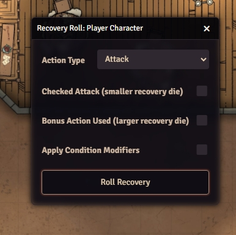
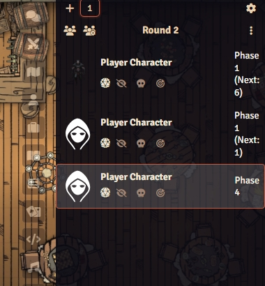
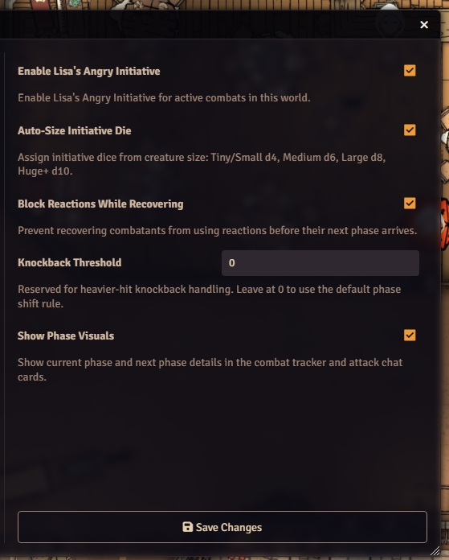

# Lisa's Angry Initiative v2.0.0

Recovery Time Initiative v2 for Foundry VTT and D&D5e — Now free and open-source!

Based on [The Angry GM's Recovery Time Initiative](https://theangrygm.com/fixing-initiative-because-i-want-to-part-ii-angrys-recovery-time-initiative-system/), this v2.0 module expands combat into a phase-driven loop with advanced modifiers, phase variants, custom recovery tables, and deep integration hooks.

## Features

Free and open-source module for Foundry VTT.

- **GitHub:** [Lisa's Dungeon on GitHub](https://github.com/LisasDungeon/lisas-angry-initiative)
- **License:** MIT

## Features (v2.0.0)

### Core System
- Phase-based combat from Phase 1 through Phase 10 (or variant count)
- Size-based initiative dice (tiny d4 → gargantuan d12)
- Recovery rolls tied to attacks, spells, movement, and ready actions
- Recovery-state reaction blocking

### Advanced Modifiers
- Condition-based die adjustments (stunned, paralyzed, exhaustion, inspired, blessed, haste)
- Bonus action upsizing (die advancement by one step)
- Checked attack downsizing (die reduction by one step, minimum d4)
- Stacking modifier support

### Phase Variants
- **Standard** — Phase 1-10, traditional recovery mechanics
- **Gritty** — Phase 1-12, longer tactical positioning window
- **Heroic** — Phase 1-8, faster action economy
- **Custom** — Create unlimited custom variants with arbitrary phase counts

### Custom Recovery Tables
- Define recovery rules per action type (attacks, spells, movement, etc.)
- Pre-built tables: Standard Melee, Spellcaster, Archer
- Mix and match rules for homebrew mechanics
- GM-configurable per world

### Recovery History Tracking
- Per-combatant recovery log (up to 100 entries)
- Timestamp, action type, die, roll result, conditions
- Query history for tactical decisions

### Phase Indicators
- Visual phase badges on token displays
- Combat tracker integration
- Real-time phase state tracking
- Color-coded phase display

### Integration Hooks
- `beforePhaseChange` — Pre-phase modification
- `afterPhaseChange` — Post-phase triggers
- `beforeRecoveryRoll` — Pre-roll adjustments
- `afterRecoveryRoll` — Post-roll processing
- `beforeCombatStart` — Combat setup
- `afterCombatEnd` — Combat cleanup
- `onConditionApplied` — Condition triggers
- `onConditionRemoved` — Condition cleanup

Custom module developers can hook into any stage of combat flow.

## Screenshots





## Current compatibility

- **Foundry VTT:** v13+ (verified v14)
- **D&D5e System:** v3.0+

## Quick start

1. Install the premium package through your Patreon distribution flow.
2. Enable `Lisa's Angry Initiative` in your world.
3. Start combat and the module assigns opening phase from each combatant's initiative die.
4. At the end of each turn, roll recovery to determine the next phase.

## Recovery basics

- **Attacks** use the weapon's recovery die.
- **Cantrips** use `d6`.
- **Leveled spells** use `d8`, or `d10` when upcast.
- **Dash, Disengage, Dodge, Hide** use the combatant's initiative die (size-based).
- **Ready without a trigger** returns the combatant to Phase 1 next round.

Bonus actions upsize the recovery die by one step. Checked attacks downsize it by one step, to a minimum of `d4`.

Conditions like exhaustion, stunning, paralysis also adjust recovery dice.

## API

The module exposes a comprehensive public API through `game.modules.get('lisas-angry-initiative').api` or `window.LisasAngryInitiative`.

### Recovery Methods
```javascript
getRecoveryDie(actionType, options)
getInitiativeDieBySize(actor)
upsizeDie(die)
downsizeDie(die)
applyAdvancedModifiers(die, combatant, options)
rollRecovery(combatant, actionType, options)
getHistory(combatantId, limit)
clearHistory(combatantId)
clearAllHistory()
```

### Phase Variant Methods
```javascript
getActiveVariant()
setActiveVariant(variantId)
getAllVariants()
createCustomVariant(variantId, config)
deleteCustomVariant(variantId)
getPhaseCount()
constrainPhase(phase)
constrainRecovery(rollResult)
```

### Custom Recovery Table Methods
```javascript
createTable(tableId, config)
getRecoveryDieFromTable(tableId, actionType)
getAllTables()
deleteTable(tableId)
updateTableRules(tableId, rules)
```

### Integration Hook Methods
```javascript
registerHook(hookId, handler)
fireHook(hookId, context)
unregisterHook(hookId, handler)
getAllHooks()
```

### Phase Indicator Methods
```javascript
getTokenIndicator(tokenId)
setTokenIndicator(tokenId, phase)
removeTokenIndicator(tokenId)
getAllIndicators()
createPhaseDisplayUI()
```

### Module Info
```javascript
getVersion()
getStatistics()
```

## Documentation

- `docs/API.md` — Full API reference with examples
- `docs/gm-guide.md` — GM workflow and rulings
- `docs/phase-variants.md` — Variant rules and customization
- `docs/recovery-tables.md` — Custom table creation guide

## Support

For release access, support updates, and premium distribution:

- **Patreon:** [Lisa's Dungeon Patreon](https://patreon.com/LisasDungeon)

For direct inquiries:

- **Email:** [lisasdungeon@gmail.com](mailto:lisasdungeon@gmail.com)
- **Discord:** MystryssLysa

## License

This project is proprietary Lisa's Dungeon intellectual property. See [`LICENSE`](LICENSE).

---

**Lisa's Angry Initiative v2.0.0** — Combat reimagined through recovery time and phase-driven mechanics.
